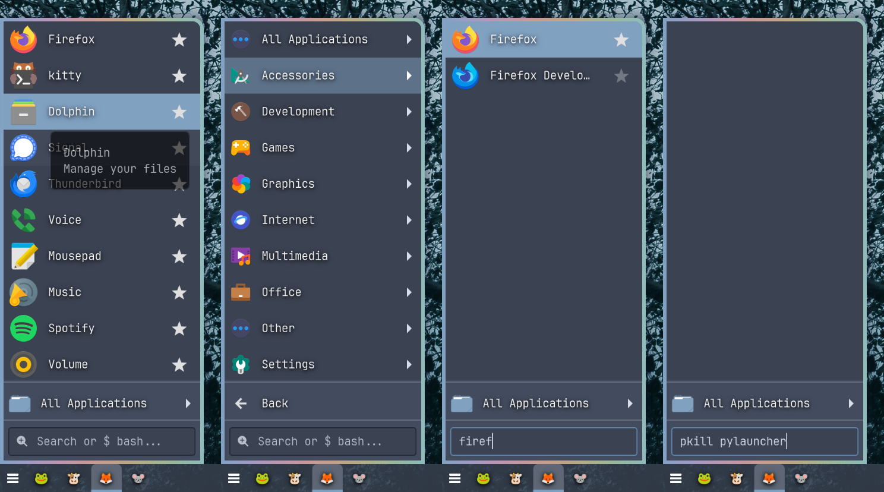

# launcher



A simple application launcher I wrote during my transition from xfce-panel's whisker-menu to waybar.

## Features

- **Starring applications** adds them to the main startup view and creates the file `~/.config/launcher-favorites.json`. Favorites can be reordered by dragging them.
- **Command execution**: if your search doesn't match an application, pressing Enter runs it as a command (e.g. `pkill waybar`).
- **Categories, search, and full keyboard navigation** out of the box, with right-click to launch or open a `.desktop` file's location.
- **Daemon mode**: runs hidden and toggles instantly, and signals waybar when shown/hidden.

## Building

```sh
cargo build --release
```

The binary is at `target/release/launcher`.

## Usage

Run it directly, or start it hidden as a daemon and toggle it with a keybind:

```sh
launcher --daemon   # start hidden in the background
launcher            # toggle the running daemon's visibility
```

Running `launcher` while a daemon is already running signals the existing instance (via `/tmp/launcher.lock`) instead of starting a new one, so you can bind a single command to a key. It also signals waybar (`pkill -RTMIN+8 waybar`) whenever it's shown or hidden.

## Shell Configuration

The command-execution fallback runs through your `$SHELL` (falling back to `/bin/sh`), so aliases and functions defined in your shell config resolve as expected. No configuration needed.

## Window Styling (Niri)

I style it in niri with:

```
window-rule {
    match app-id="launcher"
    open-floating true
    opacity 1.0
    default-window-height { proportion 0.37; }
    default-column-width { proportion 0.11; }
    default-floating-position x=0 y=0 relative-to="bottom-left"
    geometry-corner-radius 0 8 0 0
}
```
